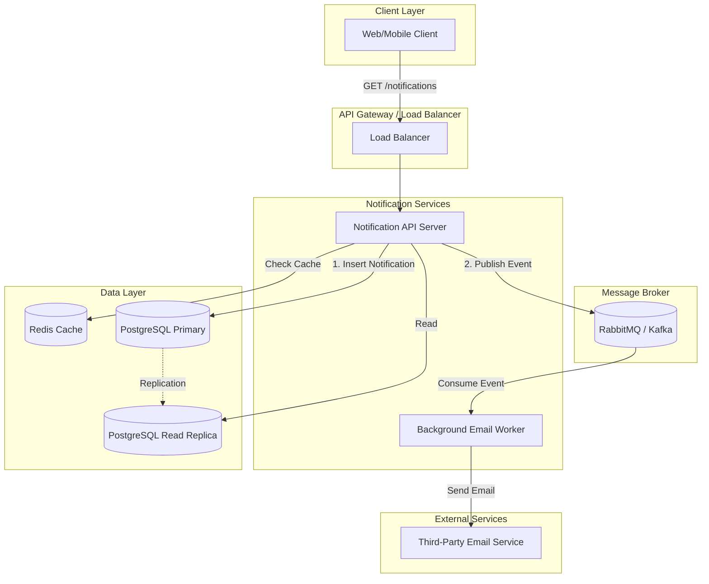
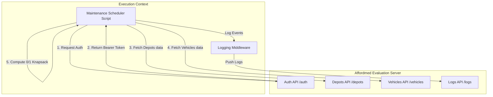

# System Architecture Design

This document outlines the architecture design for the Microservices implemented in this assessment.

---

## 1. Campus Notifications Microservice Architecture

The notification system is designed for high throughput, real-time delivery, and fault tolerance.

### Architecture Diagram

### Key Architectural Decisions:
1. **Asynchronous Processing**: The use of a Message Broker (RabbitMQ) decouples the API from the slow third-party email service, ensuring the API responds instantly and prevents request timeouts.
2. **Caching Strategy**: Redis caches unread notifications to handle sudden traffic spikes (e.g., when 50,000 students log in simultaneously).
3. **Database Replication**: Offloading read queries to a PostgreSQL Read Replica prevents heavy read traffic from locking or slowing down write operations.

---

## 2. Vehicle Maintenance Scheduler Architecture

The scheduler microservice interacts securely with external APIs to aggregate data and compute the optimal maintenance schedule.

### Architecture Diagram

### Key Architectural Decisions:
1. **Separation of Concerns**: The `logging_middleware` is decoupled into its own reusable package, handling its own authentication caching and payload validation.
2. **Algorithmic Efficiency**: The scheduler leverages Dynamic Programming (0/1 Knapsack) to find the absolute mathematical optimum impact score without relying on brute force or external libraries.
